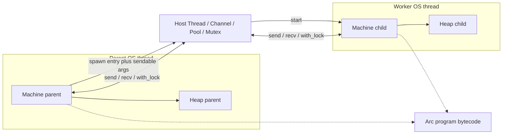

# Native Threads, ThreadPool, Channels, and Locks

## Status

**Design locked** (investigation + user choices). Implementation not yet started.

| Decision | Choice |
|----------|--------|
| Delivery scope | **Full:** `Thread` + `Channel` + `ThreadPool` + **locks** (`Mutex`, `RwLock`) in one cut |
| Channel / join payloads | **Sendable subset** deep-copied: immediates, `string`, and nested arrays/tuples/records/enums of sendables. **Rejected:** `Stream`, `Thread`, `Coroutine`, `Fn` / `PolyFn` (and other non-listed opaques) |
| Runtime model | **One `Machine` per OS thread** (isolate); no shared VM heap |
| Language surface | Virtual module `thread` via **HostInvoke** (mirror `io`) — no new opcodes |
| `ARCHIVE_VERSION` | **No bump** (HostInvoke-only; append heap `Object` variants only) |

Related docs today: OS threads are explicitly **not** builtins ([`docs/reference/built-ins.md`](docs/reference/built-ins.md)); cooperative coroutines remain orthogonal ([`docs/tutorial/08-coroutines.md`](docs/tutorial/08-coroutines.md)).

---

## Why isolate Machines (not a shared heap)

Current VM assumptions that forbid a shared-heap design without a concurrent GC project:

- Single `Machine` owns `heap`, `stack`, `frames`, `resume_stack`, `statics`, `alloc_counter` ([`machine/src/vm.rs`](machine/src/vm.rs)).
- Stop-the-world GC roots only that machine’s stack + coroutines ([`Machine::gc_collect`](machine/src/vm.rs)).
- `Gc::payload_mut(&self)` is documented **single-threaded VM only** ([`machine/src/memory/heap.rs`](machine/src/memory/heap.rs)).
- Coroutines splice into the **shared** operand stack (`ResumeCtx`); they are cooperative on one runner, not OS threads.
- `Value` is an untagged word (immediate or heap address) with no heap provenance ([`common/src/value.rs`](common/src/value.rs)).

**Chosen model:** each OS thread runs its own `Machine` with a private heap/stack/frames/statics. Threads share only:

1. Immutable program data (bytecode + constant pool + debug locs) — `Arc`-backed.
2. Host native registry (`Arc<dyn NativeFn>` already `Send + Sync`).
3. Host-owned sync objects (`Thread` join state, channel ends, pool workers, **`Mutex` / `RwLock` cells**) living **outside** any coil heap.

Cross-thread communication deep-copies **sendable** values through a portable intermediate (see § Deep-copy). Callables are never copied as heap `Fn` values — `spawn` / `submit` pass a capture-free bytecode entry plus optional sendable args.



---

## User-facing API (locked)

Module path: **`thread`** (explicit `use thread::*;`). Nested optional later; v1 is flat like core `io`.

### Opaque types

| Type | Meaning |
|------|---------|
| `Thread` | Join handle for a spawned OS thread (or pool job) |
| `Sender` | Channel send endpoint |
| `Receiver` | Channel receive endpoint |
| `ThreadPool` | Fixed-size worker pool |
| `Mutex` | Mutual-exclusion lock over a sendable cell (use `unit` for a bare lock) |
| `RwLock` | Readers–writer lock over a sendable cell |

All are `Ty::Con(...)` opaque types (same pattern as `Stream`). Runtime: heap `Object::…` variants holding `Arc<…>` to host state.

### Error type

Unit enum `ThreadError` (lazy-registered on `use thread::*`, same as `IoError`):

| Variant | When |
|---------|------|
| `WouldBlock` | `try_send` / `try_recv` / `try_lock` / `try_read` / `try_write` would wait |
| `Disconnected` | Peer dropped / channel closed |
| `JoinFailed` | Worker panicked or join already consumed |
| `NotSendable` | Value is not in the sendable subset (`Stream` / `Thread` / `Coroutine` / `Fn` / captures / cycles / …) |
| `PoolShutdown` | `submit` after pool shutdown |
| `Poisoned` | Lock was held when another thread panicked inside `with_lock` / `with_write` / … |
| `Other` | Catch-all |

Results: `Result<T, ThreadError>` via existing prelude `Result`.

### Functions

```coil
// --- Thread ---
// Spawn a capture-free function by bytecode entry on a new OS thread.
// Optional args must be sendable (see § Deep-copy); they are deep-copied
// into the child Machine and applied to `f`. Closures with captures and
// heap Fn values are NOT copied across threads.
fn spawn(f: () -> T) -> Result<Thread, ThreadError>
fn spawn(f: (A) -> T, arg: A) -> Result<Thread, ThreadError>   // A sendable

// Block until the thread finishes; deep-copy the return value into the
// caller's heap (return type must be sendable). Consumes the join
// (second join → JoinFailed).
fn join(t: Thread) -> Result<T, ThreadError>

// Detach: allow the thread to run without join. Further join → JoinFailed.
fn detach(t: Thread) -> Result<(), ThreadError>

// --- Channel (unbounded MPSC host queue; directional) ---
// T must be sendable (immediates / string / nested aggregates of those).
fn channel[T]() -> (Sender, Receiver)

fn send[T](tx: Sender, value: T) -> Result<(), ThreadError>
fn recv[T](rx: Receiver) -> Result<T, ThreadError>          // blocking
fn try_send[T](tx: Sender, value: T) -> Result<(), ThreadError>
fn try_recv[T](rx: Receiver) -> Result<T, ThreadError>      // WouldBlock if empty
fn close(tx: Sender) -> Result<(), ThreadError>             // optional; Drop also closes

// --- ThreadPool ---
fn pool(workers: int) -> Result<ThreadPool, ThreadError>    // workers >= 1
fn submit[T](p: ThreadPool, f: () -> T) -> Result<Thread, ThreadError>
fn submit[T, A](p: ThreadPool, f: (A) -> T, arg: A) -> Result<Thread, ThreadError>
fn shutdown(p: ThreadPool) -> Result<(), ThreadError>       // refuse new submit; join workers

// --- Mutex (sendable cell + exclusion; use `mutex(())` for a bare lock) ---
// Initial value must be sendable. Stored on the host as PortableValue.
fn mutex[T](initial: T) -> Result<Mutex, ThreadError>

// Preferred API: run `f` on the *calling* Machine while holding the lock.
// Decodes T into this heap, runs f (local callable — NOT sent across threads),
// encodes the returned T back into the host cell, returns R.
// R must be usable on this Machine (typically sendable if later joined/sent).
fn with_lock[T, R](m: Mutex, f: (T) -> (T, R)) -> Result<R, ThreadError>

// Lower-level exclusion (also used for `mutex(())` bare locks).
fn lock(m: Mutex) -> Result<(), ThreadError>
fn try_lock(m: Mutex) -> Result<(), ThreadError>            // WouldBlock
fn unlock(m: Mutex) -> Result<(), ThreadError>

// --- RwLock (shared reads / exclusive writes over a sendable cell) ---
fn rwlock[T](initial: T) -> Result<RwLock, ThreadError>
fn with_read[T, R](l: RwLock, f: (T) -> R) -> Result<R, ThreadError>       // T by value copy out
fn with_write[T, R](l: RwLock, f: (T) -> (T, R)) -> Result<R, ThreadError>
fn try_read[T, R](l: RwLock, f: (T) -> R) -> Result<R, ThreadError>        // WouldBlock
fn try_write[T, R](l: RwLock, f: (T) -> (T, R)) -> Result<R, ThreadError>
```

Notes:

- **No method syntax required for v1** (free functions + UFCS later if desired). Mirror `io` free fns.
- **`spawn` / `submit` take a capture-free callable** (typically a top-level `fn`). Implementation records the bytecode `entry` (+ arity) from the `ObjFn` / function value and **discards** any heap Fn identity — empty `captures` / `captured_args` required, else `NotSendable` (or a type/diagnostic error). Optional sendable args are deep-copied into the child and applied there. Capturing lambdas are rejected.
- **`Sender` / `Receiver` / `Mutex` / `RwLock` are host handles**, not channel *payloads*. They may be passed as `spawn`/`submit` arguments (re-wrap the same `Arc` on the child heap). They must **not** appear inside a `send`/`recv`/`join` message body. `Thread` / `ThreadPool` are never sendable payloads or spawn args.
- **Locks hold sendable cells on the host**, not live coil heap pointers — so isolate Machines stay sound. `with_lock` / `with_read` / `with_write` always run the callback on the **caller’s** Machine (local `Fn`); only the cell contents cross the host boundary via `PortableValue`.
- **Prefer `with_lock` / `with_write` over bare `lock`/`unlock`** so users cannot forget to unlock. Bare `lock`/`unlock` remain for simple critical sections (`mutex(())`) and for interleaving with channel ops when a closure is awkward.
- **Poisoning:** if a thread panics (or sets the VM panic flag) while inside `with_lock` / `with_write`, the lock becomes `Poisoned`; later acquires return `ThreadError::Poisoned`.
- **Generics:** schemes are polymorphic in sendable `T` / `A` / `R` via HM type variables in `thread_fn_scheme`. Prefer real polymorphism: `Scheme` with quantified vars + sendability constraints.
- **Statics are per-Machine:** child threads do **not** see parent `static` mutations. Document this.
- **Coroutines stay single-Machine:** `async fn` / `resume` do not cross OS threads. Spawning an `async fn` is a type error (spawn expects an ordinary function, not `coroutine<…>`).

### Example sketches

`examples/thread_join.hy` → print `42`:

```coil
use thread::*;

fn work() -> int {
    return 40 + 2;
}

fn main() {
    let t = spawn(work)?;
    print "%i", join(t)?;
}
```

`examples/thread_channel.hy` → print `hello`:

```coil
use thread::*;

fn producer(Sender tx) -> int {
    send(tx, "hello")?;
    return 0;
}

fn main() {
    let pair = channel();
    let tx = pair[0];
    let rx = pair[1];
    let t = spawn(producer, tx)?;
    print "%s", recv(rx)?;
    join(t)?;
}
```

`examples/thread_mutex.hy` → print `2` (two workers increment a shared counter):

```coil
use thread::*;

fn bump(Mutex m) -> int {
    with_lock(m, |n| {
        return (n + 1, 0);
    })?;
    return 0;
}

fn main() {
    let m = mutex(0)?;
    let t1 = spawn(bump, m)?;
    let t2 = spawn(bump, m)?;
    join(t1)?;
    join(t2)?;
    let n = with_lock(m, |n| { return (n, n); })?;
    print "%i", n;
}
```

(Exact closure / block syntax for `with_lock` callbacks must match current grammar — if inline lambdas are awkward, use a named `fn inc(int n) -> (int, int)` and pass that capture-free callable.)

`examples/thread_pool.hy` → print sum of parallel jobs (each job returns a sendable `int`; no Fn/captures in messages).

---

## Runtime architecture

### Host state (new crate module)

New file: [`machine/src/thread.rs`](machine/src/thread.rs) (and `mod thread;` from `machine/src/lib.rs`).

```text
JoinState {
  done: Mutex<Option<Result<PortableValue, String>>>,  // panic message or value
  finished: Condvar,
}

ObjThread payload → Arc<JoinState> + Option<JoinHandle<()>>

ChannelInner {
  queue: Mutex<VecDeque<PortableValue>>,
  closed: AtomicBool / flag under mutex,
  not_empty / not_full: Condvar,  // unbounded → only not_empty needed
}
Sender / Receiver → Arc<ChannelInner> (+ Generation / id for disconnect)

PoolInner {
  workers: Vec<JoinHandle<()>>,
  job_tx: std::sync::mpsc::Sender<Job>,  // Job = Box<dyn FnOnce() + Send>
  shutdown: AtomicBool,
}

// User-facing locks (host cells; coil heaps never hold the payload pointer)
MutexInner {
  lock: std::sync::Mutex<PortableValue>,  // or Mutex<(PortableValue, poisoned: bool)>
}
RwLockInner {
  lock: std::sync::RwLock<PortableValue>,
}
ObjMutex / ObjRwLock → Arc<MutexInner> / Arc<RwLockInner>
```

Worker threads for `spawn` / pool:

1. Build a fresh `Machine` with `Arc` program + cloned host-native list.
2. Resolve the capture-free function by bytecode `entry` (shared program). Deep-copy any sendable spawn args into the child heap; re-wrap `Sender`/`Receiver`/`Mutex`/`RwLock` args as host `Arc`s. Reject non-empty Fn captures.
3. Invoke the function (reuse nested-call / `call_function` path).
4. Deep-copy the return `Value` into a `PortableValue` (**sendable subset only**); store in `JoinState`.
5. On panic / VM panic flag → `JoinFailed` / error string. If panic occurs while a `with_lock`/`with_write` callback is active on that Machine, mark the corresponding lock poisoned.

### Making `Machine` movable onto threads

Today `OutputSink = Box<dyn IoWrite>` without `Send` → `Machine: !Send`.

Required plumbing:

- Change output trait object to `Box<dyn IoWrite + Send>` (or `Mutex<Box<dyn IoWrite + Send>>` if parents share a stdout sink).
- Pipeline / test `SharedBuf` adapters must be `Send` (use `Arc<Mutex<Vec<u8>>>` instead of `Rc<RefCell<…>>` where threads need capture).
- Child machines default to inheriting a shared `Arc<Mutex<dyn Write + Send>>` for `print`, or discard output unless configured — **default: share parent stdout via `Arc<Mutex<…>>`** so examples’ `print` from workers is visible and ordered coarsely.

### Program sharing

Add something like:

```rust
pub struct SharedProgram {
    pub code: Arc<[Byte]>,      // or Arc<Vec<Byte>>
    pub constants: Arc<[u64]>,
    pub static_slot_count: u32,
    pub debug: Option<Arc<ProgramDebug>>,
}
```

Parent `run_with_pool` installs `SharedProgram` on the machine. Spawn clones the `Arc`s into the child. No bytecode mutation at runtime today, so sharing is sound.

### Heap object variants

Append to `Object` in [`machine/src/memory/heap.rs`](machine/src/memory/heap.rs):

- `Thread(RefThread)` — `Arc<JoinState>` (+ join handle ownership rules)
- `Sender(RefSender)`, `Receiver(RefReceiver)`
- `ThreadPool(RefPool)`
- `Mutex(RefMutex)`, `RwLock(RefRwLock)` — `Arc` to host cells

GC: these hold **no coil `Value` roots** (only `Arc` to host). Mark/size/display arms required; Drop may `detach` / `close` defensively.

**No new opcodes. No `ARCHIVE_VERSION` bump.**

---

## Deep-copy / `PortableValue` (sendable subset)

### What may cross a thread boundary

**Allowed (structurally deep-copied):**

- Immediates: `int`, `float`, `bool`, `byte`, `unit`, and other immediate bit-patterns
- `string`
- Nested aggregates whose **every** element/field is sendable: arrays, tuples, record/dict instances, enums (including payloads)

**Rejected (`NotSendable` at runtime; typechecker when resolved):**

- `Stream`
- `Thread`
- `Coroutine` / `coroutine<…>`
- `Fn` / `PolyFn` (including capturing lambdas and partial applications)
- `Library`, `ThreadPool`, `Mutex`, `RwLock`, and any other opaque not listed as allowed
- Cycles in the object graph (v1)

**Narrow spawn-arg exception (not channel message bodies):**

- `Sender` / `Receiver` / `Mutex` / `RwLock` may be passed as `spawn` / `submit` arguments by re-wrapping the host `Arc` onto the child heap. They are **not** valid `send`/`recv`/`join` payload types.

### Portable IR

Host-side enum (not a coil type) — **no Fn / handle variants for messages**:

```rust
enum PortableValue {
    Immediate(u64),           // raw Value bit pattern for immediates / null
    String(String),
    Array(Vec<PortableValue>),
    Tuple(Vec<PortableValue>),
    Enum { tag: u32, payload: Vec<PortableValue> },
    Instance { fields: Vec<(String, PortableValue)> }, // dict / class instance; fields sendable
    Boxed(PortableValue),
}

/// Spawn/submit args only — not used inside channel queues / join results.
enum SpawnArg {
    Value(PortableValue),
    Sender(Arc<ChannelInner>),
    Receiver(Arc<ChannelInner>),
    Mutex(Arc<MutexInner>),
    RwLock(Arc<RwLockInner>),
}
```

### Copy rules

| Source `Object` | Action |
|-----------------|--------|
| Immediate `Value` | Bit-copy into `Immediate` |
| `String` | Own `String` bytes |
| `Array` / `Tuple` / `Enum` / `Boxed` | Recurse; any nested reject aborts with `NotSendable` |
| `Instance` | Recurse field table (string keys + members); same reject rules |
| `Fn` / `PolyFn` | **`NotSendable`** (callables cross threads only as capture-free bytecode `entry` for `spawn`/`submit`) |
| `Library` | **`NotSendable`** |
| `Stream` | **`NotSendable`** |
| `Coroutine` | **`NotSendable`** |
| `Thread` / `ThreadPool` / `Mutex` / `RwLock` | **`NotSendable`** as message/`join` payloads |
| `Sender` / `Receiver` / `Mutex` / `RwLock` | Allowed only as `SpawnArg` host-Arc rewrap (not inside nested message graphs) |

Cycle handling: track visited heap addresses while encoding; on back-edge → `NotSendable`.

Decode: allocate into the **destination** `Heap`, reconstructing objects. Strings go through `heap.intern`.

API:

```rust
pub fn value_to_portable(heap: &Heap, v: Value) -> Result<PortableValue, ThreadErrorKind>;
pub fn portable_to_value(heap: &mut Heap, p: PortableValue) -> Result<Value, ThreadErrorKind>;
pub fn value_to_spawn_arg(heap: &Heap, v: Value) -> Result<SpawnArg, ThreadErrorKind>;
```

Used by: `send`/`recv`/`join` (portable subset only); `spawn`/`submit` (entry + `SpawnArg` list).

### Typechecker sendability (best-effort)

Static check for `send` / `recv` type arg `T`, `join` result `T`, mutex/rwlock cell types, and `spawn`/`submit` data args:

- **Sendable:** immediates, `string`, arrays/tuples/records/enums/aliases thereof when all leaves are sendable.
- **Not sendable (payloads):** `Stream`, `Thread`, `ThreadPool`, `Mutex`, `RwLock`, `coroutine<…>`, function types / `Fn`, `Library`.
- **Spawn-arg handles:** `Sender` / `Receiver` / `Mutex` / `RwLock` allowed only as `spawn`/`submit` argument types; rejected as `channel`/`send`/`join` payload types.
- Open type variables: allow; runtime deep-copy remains the source of truth (`NotSendable`).

Mirror FFI’s `is_ffi_marshallable_ty` as `is_thread_sendable_ty` in [`infer.rs`](compiler/src/typechecking/infer.rs).

---

## Compiler / typechecker / pipeline checklist

Follow the `io` layering exactly.

| Layer | Work |
|-------|------|
| [`common/src/builtins.rs`](common/src/builtins.rs) | `ThreadError` name + variant list; reserve enum name |
| [`compiler/src/typechecking/virtual_modules.rs`](compiler/src/typechecking/virtual_modules.rs) | `THREAD_MODULE`, `ThreadBuiltin` enum, exports (`OpaqueType` + `ThreadFn` / reuse host-fn kind), `native_name()` prefixes (`thread_spawn`, …) |
| [`compiler/src/typechecking/ty.rs`](compiler/src/typechecking/ty.rs) | `thread_ty()`, `sender_ty()`, `receiver_ty()`, `thread_pool_ty()`, `mutex_ty()`, `rwlock_ty()` |
| [`compiler/src/typechecking/infer.rs`](compiler/src/typechecking/infer.rs) | Lazy `ThreadError` registration; `thread_fn_scheme`; `thread_fn_in_scope`; `parse_type_name_str` for opaque names; sendability checks |
| [`compiler/src/lib.rs`](compiler/src/lib.rs) | Call arm: if `thread_fn_in_scope` → same HostInvoke emission as IO (generalize `emit_io_host_invoke` → `emit_host_invoke(native_name, args)`). `with_lock` / `with_read` / `with_write` pass the callback as a normal local callable arg (HostInvoke runs it via nested call on the same Machine). |
| [`compiler/src/pipeline.rs`](compiler/src/pipeline.rs) | `register_thread_natives()` from `Pipeline::new()`; id-only registration (do **not** pollute FFI type env) |
| Heap / VM | New `Object` variants; no opcode / archive changes |
| [`machine/src/thread.rs`](machine/src/thread.rs) | Host impls: threads, channels, pool, **mutex/rwlock**, portable deep-copy |
| Docs | Tutorial `11-threads.md` (include locks section); update `built-ins.md`, `modules.md`, `types.md`, `README.md` feature matrix, `examples.md` |
| Examples + goldens | `examples/thread_*.hy` including `thread_mutex.hy` + pipeline tests |
| `AGENTS.md` | Learned fact: virtual `thread` module; isolate Machines; sendable-subset channels; `Mutex`/`RwLock` host cells |

---

## ThreadPool semantics (locked)

- `pool(n)` creates `n` OS threads, each with a **long-lived** `Machine` that pulls jobs from a host queue **or** spawns a fresh Machine per job. **Prefer fresh Machine per job** for isolation (no leftover locals/statics between jobs); workers are OS threads that construct a Machine, run one job, tear down. (Cheaper pooling of Machines can be a later optimization.)
- `submit(p, f)` / `submit(p, f, arg)` records a capture-free bytecode `entry` (+ optional sendable / `Sender` / `Receiver` / `Mutex` / `RwLock` args), enqueues; a worker builds a Machine, applies args, runs, stores a **sendable** result in a `JoinState`, returns `Thread` (= join handle).
- `shutdown(p)` stops accepting jobs, waits for queue drain + workers; further `submit` → `PoolShutdown`.
- Drop of last `ThreadPool` handle triggers shutdown asynchronously or blocks — **v1: `shutdown` is explicit; Drop calls shutdown + join workers**.

---

## Interaction with existing features

| Feature | Interaction |
|---------|-------------|
| Coroutines | Per-Machine only; not sendable |
| FFI / `libffi` | Child Machine gets same host natives + can `dload` independently; avoid sharing raw `*mut Heap` across threads (already single-thread documented) |
| `io` streams | Not sendable; open files inside the worker instead |
| `print` | Shared `Send` stdout sink |
| `static` | Per-Machine; not a cross-thread broadcast |
| Locks | Host `Mutex`/`RwLock` cells shared via spawn-arg handles; callbacks run on the caller Machine |
| GC | Unchanged stop-the-world **per Machine** |
| Peephole / codegen | Unaffected |

---

## Testing plan

### Unit (machine)

- `portable_roundtrip_immediate_string_array_tuple_enum_instance`
- `portable_rejects_stream_thread_coroutine_and_fn`
- `spawn_arg_rewrapping_sender_preserves_channel_identity`
- `spawn_arg_rewrapping_mutex_shares_cell`
- `spawn_rejects_fn_with_captures`
- `spawn_join_returns_deep_copied_int`
- `channel_send_recv_across_two_machines`
- `channel_rejects_sending_fn_or_thread_handle`
- `try_recv_would_block`
- `recv_after_close_disconnected`
- `mutex_with_lock_serializes_increments`
- `mutex_try_lock_would_block`
- `mutex_poisoned_after_callback_panic`
- `rwlock_allows_concurrent_readers_exclusive_writer`
- `pool_submit_n_jobs_join_all`
- `submit_after_shutdown_errors`

### Typechecker / diagnostics

- `spawn` on non-function / wrong arity / capturing lambda
- `send` of `Stream` / `Thread` / `Mutex` / function type → diagnostic
- `join` result type not sendable → diagnostic
- `mutex` initial value not sendable → diagnostic
- Unknown `thread::` import without `use`

### Pipeline goldens

- `example_thread_join_prints_42`
- `example_thread_channel_prints_hello`
- `example_thread_mutex_prints_2`
- `example_thread_pool_prints_sum`

Run with 64MB memory limit per project preference when exercising pools (watch for leaks of `JoinState` / Machines).

---

## Implementation phases (within the Full cut)

Work can land as stacked commits on one PR, but all ship together:

1. **Plumbing:** sendable-subset `PortableValue` + `SpawnArg`; `SharedProgram`; `Send` output sink; heap object stubs.
2. **Thread:** capture-free `spawn` / `join` / `detach` + virtual module + example.
3. **Channel:** `channel` / `send` / `recv` / `try_*` + example (`spawn(producer, tx)`).
4. **Locks:** `mutex` / `with_lock` / `lock`/`unlock` + `rwlock` / `with_read` / `with_write` + `thread_mutex.hy`.
5. **ThreadPool:** `pool` / `submit` / `shutdown` + example.
6. **Docs + AGENTS.md + diagnostics polish.**

---

## Explicit non-goals (this cut)

- Shared-heap concurrent GC / true shared `Value` pointers across OS threads.
- Deep-copying `Fn` / capturing lambdas / `Thread` / `Stream` / `Coroutine` as message or join payloads.
- Bounded channels with back-pressure sizing API (`channel(capacity)` — easy follow-up; v1 unbounded).
- `Select` / multi-recv.
- Condition variables / `wait`/`notify` (follow-up on top of `Mutex`).
- RAII lock-guard types in the language (use `with_lock` / `with_write` instead).
- Structured concurrency / cancellation tokens.
- Making coroutines migrate across OS threads.
- `async`/`await` sugar over threads.
- Work-stealing pool or Machine reuse optimization.

---

## Risk register

| Risk | Mitigation |
|------|------------|
| Deep-copy of large graphs is slow / stack-overflows | Iterative encode with explicit stack; document cost; reject cycles |
| `ObjFn` entry invalid if program not shared | Always install same `SharedProgram` on children |
| Deadlock: `join` from worker on parent while parent joins worker | Document; no cycle detection in v1 |
| Deadlock: nested `with_lock` on same `Mutex` | Document non-reentrant locks; prefer single-level `with_lock` |
| Forgotten `unlock` after bare `lock` | Prefer `with_lock`; document bare API as advanced |
| Test flakiness / cwd locks | Prefer no cwd mutation; use absolute paths; avoid global process state |
| `Machine` fields still `!Send` after output fix | Audit `pending_ffi`, raw pointers; don’t move a Machine mid-`execute` |
| Panic in worker across `catch_unwind` | Catch unwinds at thread boundary; map to `JoinFailed`; poison held locks |

---

## Success criteria

- `use thread::*;` works like `use io::*;`.
- `spawn` + `join`, directional channels, `Mutex`/`RwLock`, and `ThreadPool` all work end-to-end in examples.
- Deep-copy sends only the sendable subset (immediates, `string`, nested aggregates); `Stream` / `Thread` / `Coroutine` / `Fn` fail cleanly with `NotSendable` (or a type diagnostic).
- `spawn` uses capture-free bytecode entries + optional sendable / handle args (`Sender`/`Receiver`/`Mutex`/`RwLock`) — no heap Fn cloning.
- Shared mutable state across threads goes through host lock cells (`with_lock` / `with_write`), not shared heaps.
- No `ARCHIVE_VERSION` bump; no new opcodes.
- Coroutines and single-threaded programs unchanged.
- `cargo test --workspace` green; docs updated.
