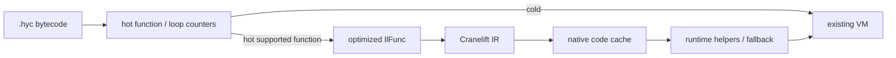

# AOT and JIT optimization roadmap

This document turns the current performance measurements into an ordered
optimization plan. The interpreter remains the compatibility path; new
optimizations must preserve archive compatibility and the existing VM
semantics.

## Baseline

Run the repeatable matrix with:

```bash
./scripts/perf_matrix.sh
```

The script builds the release binary, checks each benchmark checksum, compares
the four cross-language benchmarks (plus restored `fib`) against Lua and Node, runs the Coil-only
examples, and writes raw `poop` output plus metadata under
`/tmp/coil_perf_matrix/`. Set `OUT_DIR` for another location, `DURATION_MS`
for longer samples, or `RUN_MASSIF=1` to collect optional Valgrind Massif files.

The 2026-08-08 release baseline used precompiled Coil archives and 6-second
`poop` comparisons:

| Benchmark | Coil | Lua | Node | Dominant signal |
|-----------|------|-----|------|-----------------|
| `mandelbrot` | 32.5 ms | 15.0 ms | 15.8 ms | 573M VM instructions; numeric loop dispatch |
| `tak` | 2.09 ms | 1.31 ms | 13.4 ms | recursive direct-call/frame overhead |
| `nsieve` | 2.72 ms | 1.00 ms | 14.2 ms | array mutation, indexing, and bounds/object checks |
| `binary_trees` | 12.9 ms | 9.24 ms | 15.2 ms | heap allocation and GC |

Post–float-fusion soft baseline (`./scripts/poop_baseline.sh`, 2026-08-10):
`mandelbrot` ~19.6 ms / 392M instructions, `tak` ~2.17 ms, `nsieve` ~2.73 ms,
`binary_trees` ~12.4 ms (still directional; re-run `perf_matrix.sh` for cross-lang).

Coil used about 5.9–7.4 MB RSS, Lua 2.7–3.2 MB, and Node 89–91 MB. These are
directional comparisons rather than language rankings: the ports have
different runtime startup, library, and allocation behavior.

The repository also has Coil-only `numeric`, `operators_loop`, and `match_sum`
benchmarks. Their current results are retained by the matrix, but they have no
Lua or Node ports.

## Recently landed (float AOT)

Source-ordered float work on the interpreter path (no FMA / reassociation):

- LICM: full invariant float expression chains (past intermediate height-1).
- `FloatChainStore`: up to three stages; `BinSlotSlot` stage0; const-pool operands.
- `BinSlotSlotConstJmpf`: float mag arith + pool compare + `JMPF`.
- `NEGF` unary float negate.
- Algebraic: exact `+0.0` / `+1.0` float identities; const-pool float binop fold.
- Codegen: `new Class(args).field` scalar replacement (no temp instance).

Next AOT priorities below remain the main gap vs Lua on `mandelbrot` /
`tak` / `nsieve` / `binary_trees`.

## AOT priorities

### 1. Local slot promotion and SSA-like values

Priority: highest. **Status: Phases 1–4 of register-win harvest landed**
(`perf/register-wins-harvest`; docs ledger in § Opcode candidate ledger below).

The shared operand/local stack still makes repeated `LOAD` / `STORE` traffic
expensive. `gvn.rs` explicitly has no SSA slot rename, and the new
cursor-safe copy propagation in `opt/dce.rs` is intentionally straight-line.

**Landed (Phases 1–4, IL-only — no new opcodes):**

- store-destination coalescing and peel-param raise (`opt/slot_promote.rs`);
- copy-only latch elision when live-out / unique in-loop def allow;
- Phase 4 fuse-feed audit: FCS / `BinSlotSlotConstJmpf` / packed peels held;
  residual near-misses tallied in `perf_metrics` for the ledger.

**Harvested without opcodes (shape inventory):**

- `tak`: LOAD 11→7, STORE 7→3, `slot_move` 4→0 (coalesce + peel raise);
- fuse windows intact across mandelbrot / tak / numeric / nsieve.

Still deferred for a later SSA-like slice: overlapping live-range φ shuffles
(mandelbrot `tr`→`zr`), full rename across disagreeing joins, and operand-stack
retention across calls. Measure residual candidates against the ledger before
appending opcodes.

### 2. Loop range and bounds analysis

Priority: high.

`Index` and `StoreIndex` currently perform runtime object lookup and signed
bounds checks in `machine/src/vm.rs`. Add a proof-only IL analysis for common
counted loops:

- identify an invariant array/tuple value and a loop index;
- prove `0 <= i < len` for the loop body;
- hoist invariant length/object-kind information where the alias rules allow;
- keep the checked instruction on unknown or mutation-sensitive paths.

Start with diagnostics and bytecode-shape counters before adding a new opcode.
This targets `nsieve` and avoids benchmark-specific assumptions.

### 3. Allocation and GC fast paths

Priority: high for heap-heavy code.

`MakeTuple` and `MakeArray` currently collect stack values into a temporary
`Vec<Value>` before allocating the managed object. Profile
`machine/src/memory/heap.rs` and the aggregate handlers before changing
ownership:

- add allocation and collection counters under `vm_profile`;
- measure temporary vector allocations and live bytes;
- evaluate direct payload construction or a small fixed-arity fast path;
- keep GC rooting correct before and after allocation;
- consider region/batch allocation only after object lifetime boundaries are
  explicit.

This is the most direct path for `binary_trees`; it is independent of a JIT.

### 4. Direct-call and closure specialization

Priority: medium. **Status: partial (B4 landed).**

Landed for monomorphic known targets:

- ground trait / instance method sites emit direct `CALL` instead of
  `CodePtr` + `CallIndirect` when the entry and arity are static;
- self-recursive predicate peels (provisional body spans) so nested `tak`
  calls skip base-case frames;
- existing tiny direct-call inlining / monomorphization unchanged.

Still use `CallIndirect` for PolyFn locals, dictionary `Index` targets, and
generic shared-body evidence that is not static at the call site.

### 5. Dispatch and trace fusion

Priority: medium to low until measured.

`Machine::execute` already uses outlined dispatch, unchecked stack access, and
typed/fused opcodes. Larger universal superinstructions or short trace fusion
should be considered only if they improve multiple benchmarks. Keep symbolic IL
and the single `il::lower` pass as the source of truth; do not add an opcode
for one benchmark shape. Residual fuse near-misses after Phases 1–4 are scored
in the opcode candidate ledger below — none are an unconditional **add**.

## Opcode candidate ledger (register-win harvest Phase 5)

Scored after IL opts on Phases 1–4. **Docs only — no new opcodes from this
ledger until a candidate clears the gates.** Evidence is static shape inventory
in `compiler/tests/perf_metrics.rs` plus estimated dynamic weight on hot
benches. Append-only opcode rules still apply ([AGENTS.md](../../AGENTS.md)).

**Gates for `add`:** residual dynamic weight still material after Phases 1–4;
pattern universal (not a single-bench special); no safe IL rewrite exposes an
existing opcode; fits append-only opcode ABI.

| Family | Evidence (post Phases 1–4) | Est. dynamic weight | Recommendation | Rationale |
|--------|----------------------------|---------------------|----------------|-----------|
| `*Jmpt` counterparts (`CmpJmpt` / `BinSlot*Jmpt` / `BinSlotSlotConstJmpt` / …) | mandelbrot `would_be_jmpt_after_invert=1` (`BinSlotSlotConstJmpf`; `JMP`); bare `JMPT` only for non-fusable bools | ~1.28M/run (iter escape) | **needs more proof** | Invert intentionally refuses fused `*Jmpf` — would trade one fused dispatch for two. A true `*Jmpt` twin could collapse the escape `JMP`, but only if invert savings beat opcode + decode cost and the shape shows up beyond mandelbrot. Prefer measuring invert-with-`*Jmpt` prototype cost before appending. |
| Cast spill → `FloatChainStore` | mandelbrot `float_chain_cast_blocked=1` (`cr`) | material in mandelbrot float body | **defer** (no opcode) | Codegen/temp spill of `CastIntToFloat` would expose existing `FloatChainStore`. Prefer IL/codegen fix over a cast-in-chain opcode. |
| `FloatChain` 4-stage / wider | `float_chain_stage_cap_leftover=0` | — | **defer** | No truncation leftover on current benches; zero evidence for a wider opcode. |
| `MoveSlot` / φ shuffle | mandelbrot `loop_carried_phi_shuffle=1` (`tr`→`zr`); IL opts refused overlapping live ranges | ~2.56M dispatches/run (LOAD+STORE latch) | **needs more proof** (or defer pending benches) | Largest residual dispatch count, but mandelbrot-heavy; tak/numeric/nsieve have 0 latch shuffles. Needs universality proof (more loop-carried programs) before an append-only `MoveSlot` / rename op. Overlapping ranges may still need SSA rename rather than a 1-op shuffle. |
| Unchecked `Index` / `StoreIndex` | nsieve static Index=1 + StoreIndex=1 in hot loops | nsieve-dominant | **needs more proof** | Align with roadmap §2: diagnostics and bounds proofs first; opcode only after proof-only analysis shows a universal safe fast path. |
| Unary slot / float `BinSlotImm` / packing holes | 0 on mandelbrot/tak/numeric/nsieve | — | **defer** | Zero evidence on the hot matrix. |
| Slot move (non-latch) | numeric `slot_move` ≤3 (format/host temp) | low | **defer** | Not loop-carried; format-path noise, not a fuse candidate. |

**Already harvested without opcodes:** see §1 (tak LOAD/STORE/`slot_move`; fuse windows held). Next opcode work should re-run `perf_metrics` inventories and only promote a ledger row that still passes the `add` gates.

## Cranelift JIT feasibility

The current VM is a good fallback runtime but not a direct native ABI:

- `Value` is an untagged machine word containing immediates or raw heap
  pointers;
- locals and operands share `Stack<Value>` with a mutable `tell` cursor;
- `Frame` stores bytecode IP and stack base, while calls can re-enter through
  FFI callbacks;
- `HostInvoke`, FFI, coroutines, `CallIndirect`, debugger stops, and GC all
  require runtime coordination.

Cranelift's `JITBuilder` / `JITModule` provide the required define, finalize,
and function-pointer lookup operations:

- [JITBuilder](https://docs.rs/cranelift-jit/latest/cranelift_jit/struct.JITBuilder.html)
- [JITModule](https://docs.rs/cranelift-jit/latest/cranelift_jit/struct.JITModule.html)

Keep this dependency optional in a new `coil-jit` crate or a `jit` feature.
It should not be part of the default compiler or VM build.



### Initial JIT tier

Compile only functions containing typed numeric operations, local loads/stores,
comparisons, symbolic branches, and returns. Exclude heap allocation, field
access, host/FFI calls, coroutines, indirect calls, and debugger sessions.
This gives a useful first tier without requiring GC stack maps or speculative
deoptimization.

Use an opaque runtime context rather than exposing `Stack<Value>` internals:

```text
JitEntry(context, frame_base, stack_cursor) -> JitExit
JitExit = { reason, value, resume_pc }
```

The native body may use virtual registers for supported locals and return a
value directly. Unsupported work returns `JitExit::Fallback`; the interpreter
continues from a known bytecode boundary. Native code must not retain a heap
pointer across a helper or allocation call in this tier.

### Hotness and installation

- Count function entries first; add loop back-edge counters only after function
  JIT compilation is stable.
- Use a configurable threshold and an opt-in `--jit` / feature flag.
- Key compiled code by archive identity, function entry, and JIT version.
- Keep a runtime side table from bytecode entry PC to either bytecode or native
  entry; do not change archived `CALL` operands.
- Disable JIT dispatch while debugger state is attached, or force a deopt
  boundary before every debugger-visible operation.

## Staged gates

1. **Baseline gate:** `perf_matrix.sh` produces metadata and raw results for
   every comparison; no benchmark is accepted without a correctness checksum.
2. **AOT gate:** an optimization must improve a target benchmark by at least
   5% wall time or 10% VM instructions without regressing any benchmark by
   more than 2%, and must pass the full language and cursor-differential
   suites.
3. **JIT prototype gate:** compile one pure numeric function, call it from the
   VM, and fall back to bytecode for one unsupported operation. Verify identical
   output, no archive/opcode changes, and code-cache cleanup.
4. **JIT promotion gate:** include compile latency, warm-up time, steady-state
   wall time, RSS, and fallback frequency. Promote only if `mandelbrot` or
   `tak` improves materially after warm-up costs; otherwise prioritize slot
   promotion and allocation work.

Required verification remains:

```bash
cargo check --workspace
cargo test --workspace --lib --tests --bins
./target/debug/coil test
./scripts/perf_matrix.sh
```
