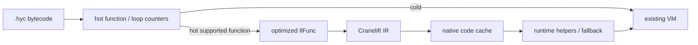

# AOT and JIT optimization roadmap

This document turns the current performance measurements into an ordered
optimization plan. The interpreter remains the compatibility path; new
optimizations must preserve archive compatibility and the existing VM
semantics.

## Baseline

Run the repeatable matrix with:

```bash
./scripts/perf_matrix.sh
```

The script builds the release binary, checks each benchmark checksum, compares
the four cross-language benchmarks against Lua and Node, runs the Coil-only
examples, and writes raw `poop` output plus metadata under
`/tmp/coil_perf_matrix/`. Set `OUT_DIR` for another location, `DURATION_MS`
for longer samples, or `RUN_MASSIF=1` to collect optional Valgrind Massif files.

The 2026-08-08 release baseline used precompiled Coil archives and 6-second
`poop` comparisons:

| Benchmark | Coil | Lua | Node | Dominant signal |
|-----------|------|-----|------|-----------------|
| `mandelbrot` | 32.5 ms | 15.0 ms | 15.8 ms | 573M VM instructions; numeric loop dispatch |
| `tak` | 2.09 ms | 1.31 ms | 13.4 ms | recursive direct-call/frame overhead |
| `nsieve` | 2.72 ms | 1.00 ms | 14.2 ms | array mutation, indexing, and bounds/object checks |
| `binary_trees` | 12.9 ms | 9.24 ms | 15.2 ms | heap allocation and GC |

Coil used about 5.9–7.4 MB RSS, Lua 2.7–3.2 MB, and Node 89–91 MB. These are
directional comparisons rather than language rankings: the ports have
different runtime startup, library, and allocation behavior.

The repository also has Coil-only `numeric`, `operators_loop`, and `match_sum`
benchmarks. Their current results are retained by the matrix, but they have no
Lua or Node ports.

## AOT priorities

### 1. Local slot promotion and SSA-like values

Priority: high (first slice landed).

The shared operand/local stack still makes repeated `LOAD` / `STORE` traffic
expensive. `gvn.rs` explicitly has no SSA slot rename, and the cursor-safe copy
propagation in `opt/dce.rs` is intentionally straight-line.

`opt/slot_promote.rs` takes the first slice using `tell` as the safety proof: a
`STORE t` reached with the cursor at `t + 1` is writing TOS back to its own
address, and the reload run in front of a `TailCall` is re-pushing values the
call already finds on the stack. Together those take argument-materialization
temps out of the frame — `tak` went from 4 LOAD words / 9 slots / 3 STOREs to 3
LOAD words / 6 slots / 0 STOREs. Joins are free: `tell` poisons a point whose
predecessors disagree, so `Known` is agreement.

What it does *not* do, and what the next slice needs (see
[limitations](limitations.md#il-optimizations-low) for the full refusal table):

- **Real slot liveness.** Without it, promotion must leave every slot with a
  visible def, which rules out `CALL` operand runs (the callee frame base is
  `tell - arity`) and any store whose slot is still read.
- **Cursor normalization at loop back edges.** `mandelbrot`'s inner loop enters
  with cursor 10 and re-enters with 13, so its header is `Unknown` and none of
  its 3 body stores are provably redundant. A `Seek` on the back edge would make
  the header `Known` and turn all three into self-stores — one dispatch per
  iteration against three stores, worth measuring.
- **Scheduling.** `mandelbrot`'s `tr → zr` copy cannot coalesce because `zr` is
  read between the def and the copy; sinking the def past that read is the fix.
- **`Bin(slot, TOS)` operand shapes.** `mandelbrot`'s remaining `LOAD 5` / `LOAD
  6` feed an `ADDF` whose other operand is on the stack, which no existing fused
  form accepts. That is an opcode question, not a promotion one.

### 2. Loop range and bounds analysis

Priority: high (first slice landed).

`Index` and `StoreIndex` still perform runtime object lookup and signed bounds
checks in `machine/src/vm.rs`, and that has not changed: the landed slice is
proof-only and touches no VM handler.

`il::bounds.rs` proves **length invariance** per natural loop instead of
per-index bounds. `StoreIndex` overwrites an element in place, so a loop that
writes `a[i]` still has an invariant `len(a)`; `ArrayPush`, a call, a host
native or any unmodelled op refuses the region. Two invariant materializations
move to the preheader on that proof — the `LOAD a; ArrayLen; STORE t` triple
codegen leaves in the header of `while i < len(a)`, and the `CONST imm; STORE t`
pair that materializes a constant addressing operand in `a[i] = 0`. `nsieve`'s
sieve loop went from 8 words per iteration to 6 (545.6k → 469.9k dispatches);
`examples/perf/vec_scan.hy`, the `while i < len(v)` scan/fill shape, from 6.58M
to 5.01M. Safety comes from the cursor: the preheader store floors it at
`t + 1`, and every in-loop stack height staying at or above the header's proves
no in-loop push can reach `t`.

What is still open (full refusal table in
[limitations](limitations.md#il-optimizations-low)):

- **`0 <= i < len` is not proven at all.** Induction-variable detection was
  deliberately left out because nothing consumes the fact: without an unchecked
  addressing form the proof cannot change a single emitted word. Pair it with
  that opcode decision, not with this pass.
- **Loops that call a helper on `b[i]`.** Most stdlib `while i < len(b)` loops do,
  and a call could `push` to the array through another reference. Wiring the
  existing purity/effect summaries into the barrier test is the widest available
  win here.
- **The `find_object_by_addr` lookup per `Index`.** Hoisting the resolved array
  means keeping a heap address live across a GC point in IL; the length hoists
  precisely because it is an `int`.

### 3. Allocation and GC fast paths

Priority: high for heap-heavy code.

`MakeTuple` and `MakeArray` currently collect stack values into a temporary
`Vec<Value>` before allocating the managed object. Profile
`machine/src/memory/heap.rs` and the aggregate handlers before changing
ownership:

- add allocation and collection counters under `vm_profile`;
- measure temporary vector allocations and live bytes;
- evaluate direct payload construction or a small fixed-arity fast path;
- keep GC rooting correct before and after allocation;
- consider region/batch allocation only after object lifetime boundaries are
  explicit.

This is the most direct path for `binary_trees`; it is independent of a JIT.

### 4. Direct-call and closure specialization

Priority: medium.

The compiler already has tiny direct-call inlining and monomorphization, but
generic dictionaries and `CallIndirect` still carry runtime work. Extend
specialization only when the target, arity, and evidence are statically known:

- devirtualize ground method and dictionary calls;
- inline small monomorphic bodies with no host, FFI, coroutine, or dynamic
  operations;
- preserve the existing `CallIndirect` and generic fallback;
- measure `tak` call count and frame traffic before and after.

### 5. Dispatch and trace fusion

Priority: medium to low until measured.

`Machine::execute` already uses outlined dispatch, unchecked stack access, and
typed/fused opcodes. Larger universal superinstructions or short trace fusion
should be considered only if they improve multiple benchmarks. Keep symbolic IL
and the single `il::lower` pass as the source of truth; do not add an opcode
for one benchmark shape.

## Cranelift JIT feasibility

The current VM is a good fallback runtime but not a direct native ABI:

- `Value` is an untagged machine word containing immediates or raw heap
  pointers;
- locals and operands share `Stack<Value>` with a mutable `tell` cursor;
- `Frame` stores bytecode IP and stack base, while calls can re-enter through
  FFI callbacks;
- `HostInvoke`, FFI, coroutines, `CallIndirect`, debugger stops, and GC all
  require runtime coordination.

Cranelift's `JITBuilder` / `JITModule` provide the required define, finalize,
and function-pointer lookup operations:

- [JITBuilder](https://docs.rs/cranelift-jit/latest/cranelift_jit/struct.JITBuilder.html)
- [JITModule](https://docs.rs/cranelift-jit/latest/cranelift_jit/struct.JITModule.html)

Keep this dependency optional in a new `coil-jit` crate or a `jit` feature.
It should not be part of the default compiler or VM build.



### Initial JIT tier

Compile only functions containing typed numeric operations, local loads/stores,
comparisons, symbolic branches, and returns. Exclude heap allocation, field
access, host/FFI calls, coroutines, indirect calls, and debugger sessions.
This gives a useful first tier without requiring GC stack maps or speculative
deoptimization.

Use an opaque runtime context rather than exposing `Stack<Value>` internals:

```text
JitEntry(context, frame_base, stack_cursor) -> JitExit
JitExit = { reason, value, resume_pc }
```

The native body may use virtual registers for supported locals and return a
value directly. Unsupported work returns `JitExit::Fallback`; the interpreter
continues from a known bytecode boundary. Native code must not retain a heap
pointer across a helper or allocation call in this tier.

### Hotness and installation

- Count function entries first; add loop back-edge counters only after function
  JIT compilation is stable.
- Use a configurable threshold and an opt-in `--jit` / feature flag.
- Key compiled code by archive identity, function entry, and JIT version.
- Keep a runtime side table from bytecode entry PC to either bytecode or native
  entry; do not change archived `CALL` operands.
- Disable JIT dispatch while debugger state is attached, or force a deopt
  boundary before every debugger-visible operation.

## Staged gates

1. **Baseline gate:** `perf_matrix.sh` produces metadata and raw results for
   every comparison; no benchmark is accepted without a correctness checksum.
2. **AOT gate:** an optimization must improve a target benchmark by at least
   5% wall time or 10% VM instructions without regressing any benchmark by
   more than 2%, and must pass the full language and cursor-differential
   suites.
3. **JIT prototype gate:** compile one pure numeric function, call it from the
   VM, and fall back to bytecode for one unsupported operation. Verify identical
   output, no archive/opcode changes, and code-cache cleanup.
4. **JIT promotion gate:** include compile latency, warm-up time, steady-state
   wall time, RSS, and fallback frequency. Promote only if `mandelbrot` or
   `tak` improves materially after warm-up costs; otherwise prioritize slot
   promotion and allocation work.

Required verification remains:

```bash
cargo check --workspace
cargo test --workspace --lib --tests --bins
./target/debug/coil test
./scripts/perf_matrix.sh
```
